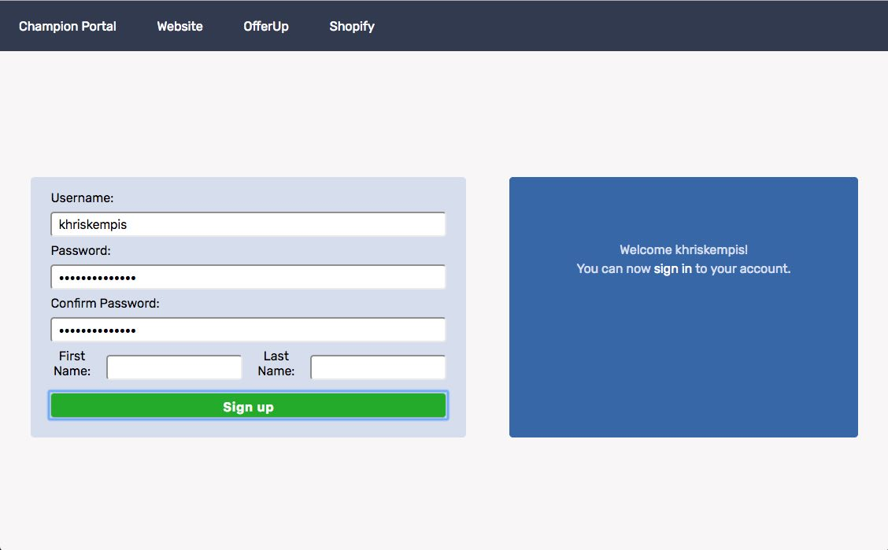
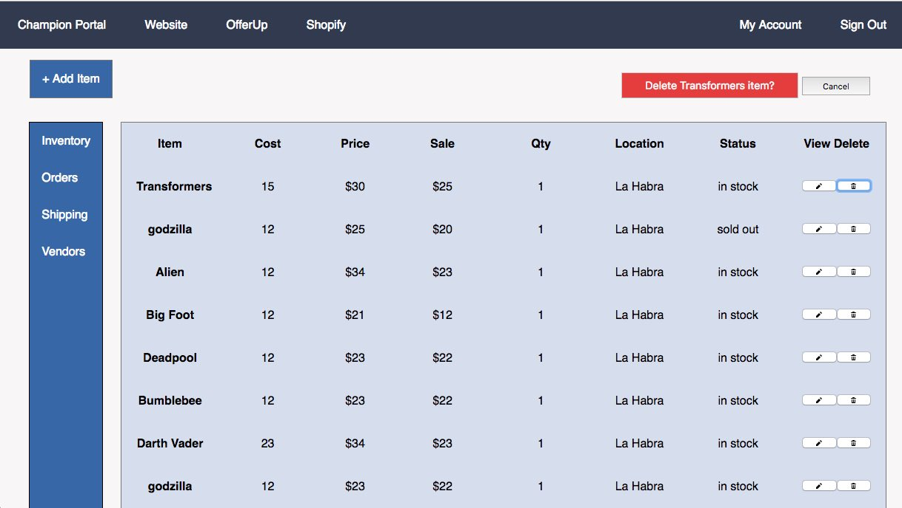
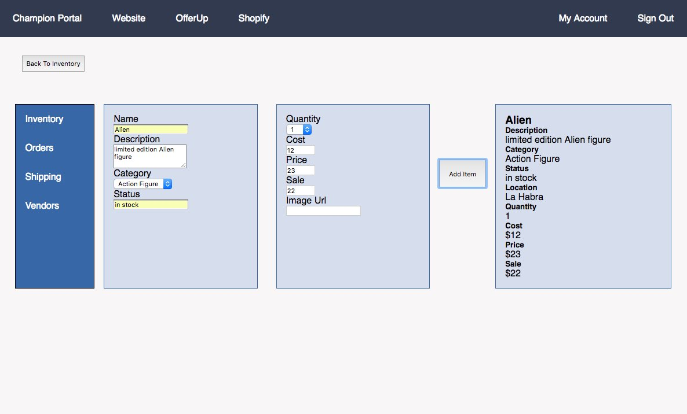
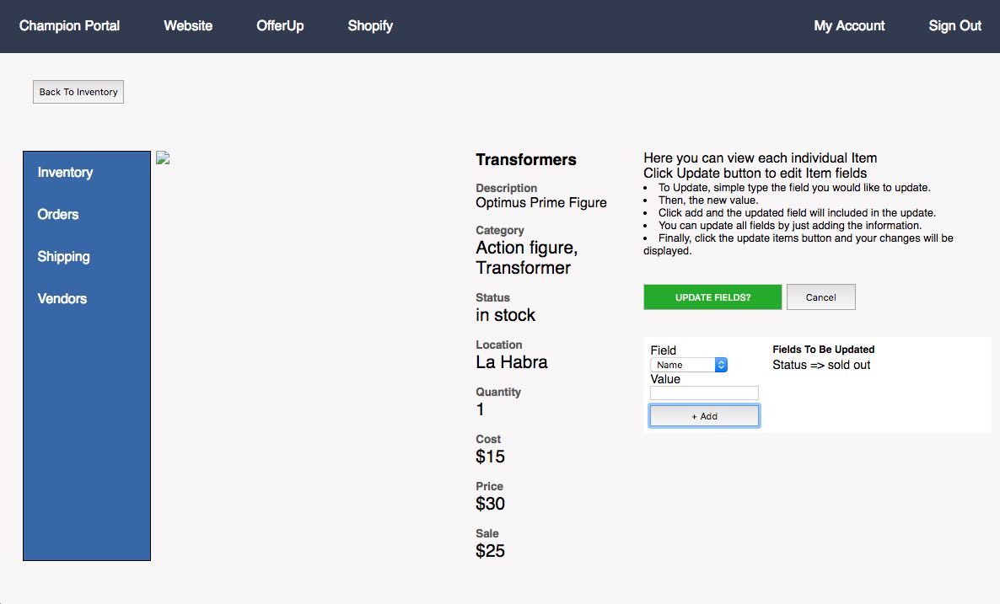

## Champion Inventory Management Tool

[Champion Comics Portal](https://obscure-springs-35933.herokuapp.com/)

#### Description

This web application is meant to be used as an internal tool to manage and organize a company's inventory of products and items.

##### Features

-	create users to be able to sign in
-	sign in using authentication
- 	viewing of entire company's inventory
-	creating items that can be added to the database
- 	viewing item and its details
- 	updating of current items in the database
- 	deleting specific items

----
##### User Flow

You will be initially be greeted by the sign in page which also includes a link to sign up for an account.

If you click the sign up link, you will be redirected to the create user page.
After successfully creating a user, you will be redirected to the sign in page where you are required to sign in. 

Once signed in, you will then have access to view the inventory.
In the upper left hand corner is a button to add and item.
To the right of each item are buttons to view/edit and delete items.

If you click the Add Item button, you will be taken to the add item page where you can input the details of a new item including description, category, status, etc.
After clicking the add item button to confirm the item, a status message is displayed telling you the item has been created along with a preview of how the item will look in the view/edit page.

From the main page, you can edit each individual item.
To update an item, simply click the update item button.
A form will pop up and will display a dropdown menu of the fields in which you can edit along with a text area to input a value.
Clicking the add button will include the field and value in the changes to be updated section.
Once you are sure of the changes to be made, click the update fields button above the form and your changes will be immediately displayed.

----

Technologies Used 

- HTML
- CSS
- jQuery
- Node.js
- Express
- Passport
- MongoDB
- Mongoose